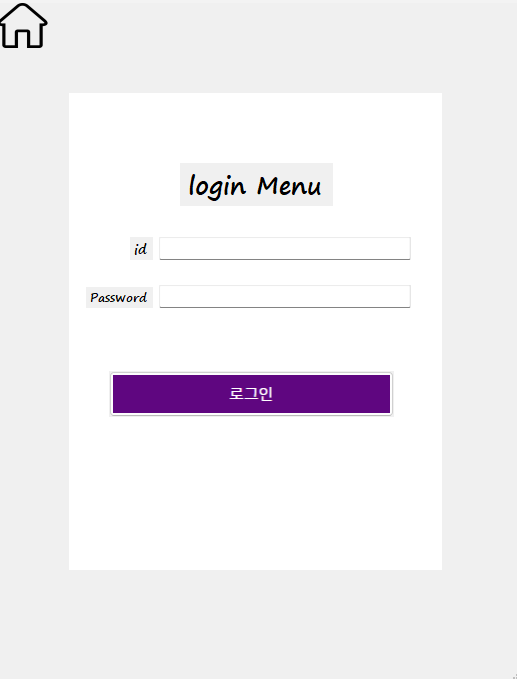
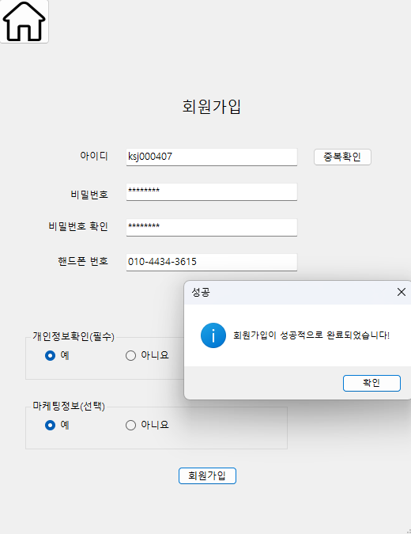
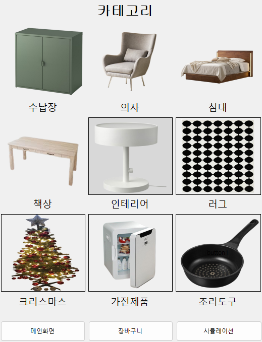
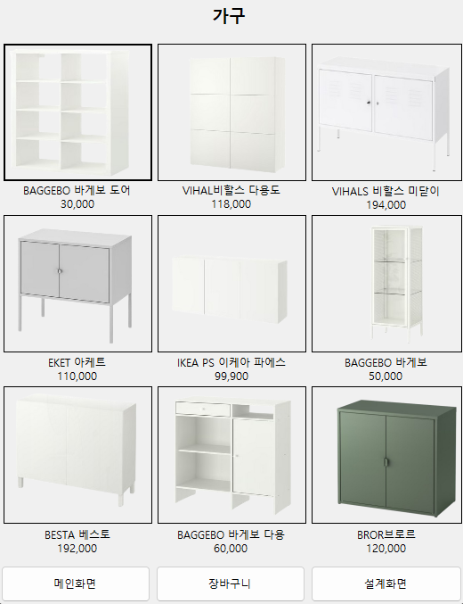
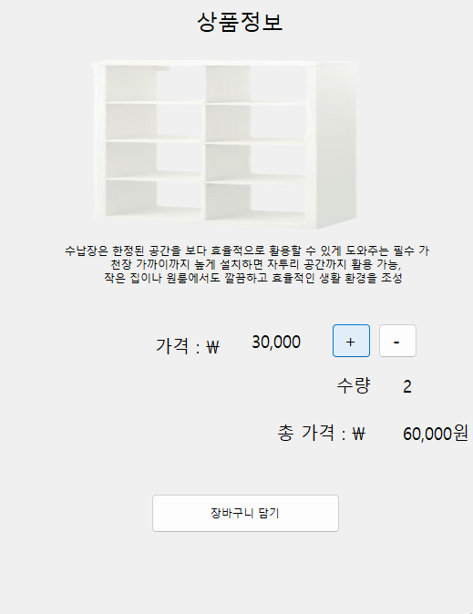
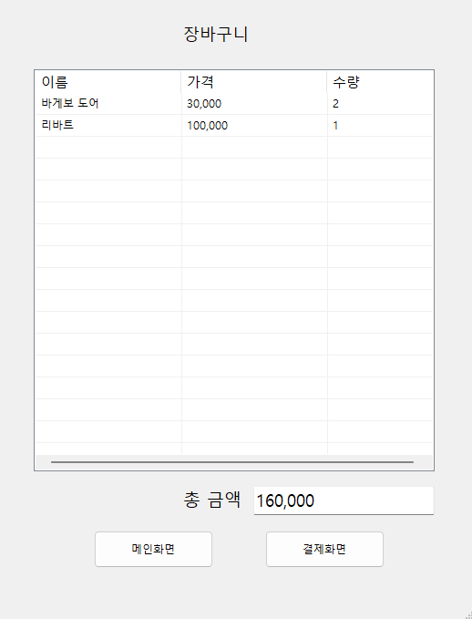
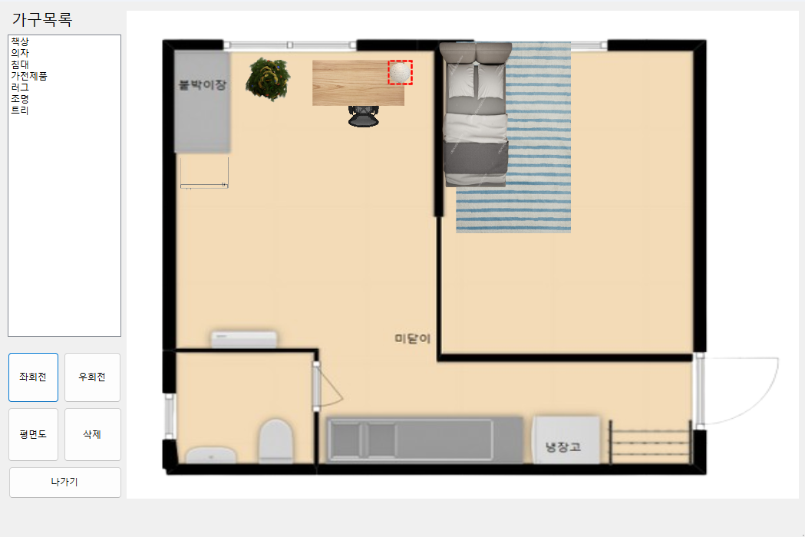
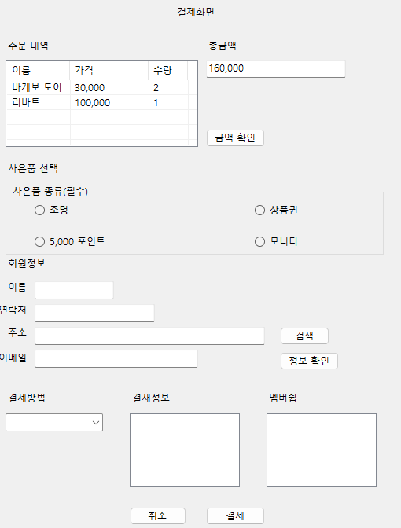

# C# WinForms 기반 가구 주문 키오스크

### 이 프로젝트는 C#과 Windows Forms를 사용하여 개발한 데스크톱 가구 주문 키오스크 애플리케이션. 
### 사용자는 회원가입부터 로그인, 상품 탐색, 장바구니, 최종 결제까지 실제 쇼핑몰과 유사한 프로세스를 경험 가능.   

# ✨ 주요 기능 (Features)

- **회원 관리**: 직관적인 UI의 회원가입 및 로그인 기능을 제공.
- **상품 탐색**: 카테고리별로 상품을 쉽게 찾아볼 수 있으며, 상세 페이지에서 자세한 정보를 확인.
- **실시간 연동**: 상품 상세 페이지에서 수량을 변경하면 총 가격이 실시간으로 자동 계산.
- **장바구니**: 선택한 상품들을 장바구니에 담고 수정할 수 있으며, 전체 주문 금액을 한눈에 확인할 수 있음.
- **주문/결제**: 주문 내역 확인, 사은품 선택, 결제 정보 입력을 통해 실제와 유사한 주문 프로세스를 시뮬레이션함.

# 🛋️ C# WinForms 가구 주문 키오스크 프로젝트

> 📅 **프로젝트 기간**: 2025.07 ~ 2025.08

# 🛠️ 기술 스택 (Tech Stack)

Language: C#

Framework: .NET Framework

UI Platform: Windows Forms

# ✨ 프로젝트 구조   

📠Project1/  
│  
├── 📄 Program.cs   
├── 📄 Project1.csproj   
│  
├── 📠Models/   
│   └── 📄 CartData.cs   
│  
├── 📠Properties/   
│   └── 📄 AssemblyInfo.cs   
│  
├── 📠Resources/   
│   └── ...  
│  
└── 📠Views/   
    │  
    ├── 📠00_Main/   
    │   ├── 📄 Main1.cs   
    │   └── 📄 Search.cs  
    │  
    ├── 📠01_User/  
    │   ├── 📄 Login.cs  
    │   ├── 📄 Resister.cs  
    │   └── 📄 information.cs  
    │  
    ├── 📠02_Products/  
    │   ├── 📄 Bed.cs  
    │   ├── 📄 Chair.cs  
    │   └── ... (기타 모든 상품 폼)  
    │  
    ├── 📠03_Order/  
    │   ├── 📄 Count.cs  
    │   └── 📄 address.cs  
    │  
    └── 📠04_Simulator/  
        └── 📄 Funiture.cs  
        
# ✨ 주요 기능 시연 (Screenshots)

시작 폼  
  
로그인 폼  
  
회원가입 폼  
  
메인 폼  
  
메뉴 폼  
  
장바구니 담기 폼  
  
장바구니 폼  
  
가구배치 폼  
  
결제 폼  
  

# 🚀 시작하기 (Getting Started)

다운로드한 폴더에서 Visual Studio 솔루션 파일(.sln)을 엽니다.

실행
Visual Studio에서 F5 키를 누르거나 '시작' 버튼을 클릭하여 프로젝트를 빌드하고 실행합니다.
