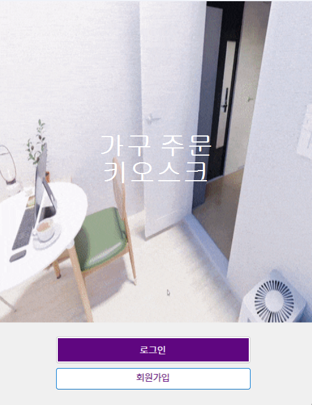

🛋️ C# WinForms 기반 가구 주문 키오스크

이 프로젝트는 C#과 Windows Forms를 사용하여 개발한 데스크톱 가구 주문 키오스크 애플리케이션. 사용자는 회원가입부터 로그인, 상품 탐색, 장바구니, 최종 결제까지 실제 쇼핑몰과 유사한 프로세스를 경험할 수 있다.

✨ 주요 기능 (Features)

- **회원 관리**: 직관적인 UI의 회원가입 및 로그인 기능을 제공.
- **상품 탐색**: 카테고리별로 상품을 쉽게 찾아볼 수 있으며, 상세 페이지에서 자세한 정보를 확인.
- **실시간 연동**: 상품 상세 페이지에서 수량을 변경하면 총 가격이 실시간으로 자동 계산.
- **장바구니**: 선택한 상품들을 장바구니에 담고 수정할 수 있으며, 전체 주문 금액을 한눈에 확인할 수 있음.
- **주문/결제**: 주문 내역 확인, 사은품 선택, 결제 정보 입력을 통해 실제와 유사한 주문 프로세스를 시뮬레이션함.

🛠️ 기술 스택 (Tech Stack)

Language: C#

Framework: .NET Framework

UI Platform: Windows Forms

✨ 프로젝트 구조
📁 Project1/
│
├── 📄 Program.cs
├── 📄 Project1.csproj
│
├── 📁 Models/
│   └── 📄 CartData.cs
│
├── 📁 Properties/
│   └── 📄 AssemblyInfo.cs
│
├── 📁 Resources/
│   └── ...
│
└── 📁 Views/
    │
    ├── 📁 00_Main/
    │   ├── 📄 Main1.cs
    │   └── 📄 Search.cs
    │
    ├── 📁 01_User/
    │   ├── 📄 Login.cs
    │   ├── 📄 Resister.cs
    │   └── 📄 information.cs
    │
    ├── 📁 02_Products/
    │   ├── 📄 Bed.cs
    │   ├── 📄 Chair.cs
    │   ├── 📄 Table.cs
    │   ├── 📄 Drawer.cs
    │   ├── 📄 Rug.cs
    │   ├── 📄 Blankit.cs
    │   └── ... (기타 모든 상품 폼)
    │
    ├── 📁 03_Order/
    │   ├── 📄 Count.cs
    │   └── 📄 address.cs
    │
    └── 📁 04_Simulator/
        └── 📄 Funiture.cs

## ✨ 주요 기능 시연 (Screenshots)

시작 폼  
  
로그인 폼  
  
회원가입 폼  
  
메인 폼  
  
메뉴 폼  
  
장바구니 담기 폼  
  
장바구니 폼  
  
가구배치 폼  
  
결제 폼  
  

🚀 시작하기 (Getting Started)

다운로드한 폴더에서 Visual Studio 솔루션 파일(.sln)을 엽니다.

실행
Visual Studio에서 F5 키를 누르거나 '시작' 버튼을 클릭하여 프로젝트를 빌드하고 실행합니다.
